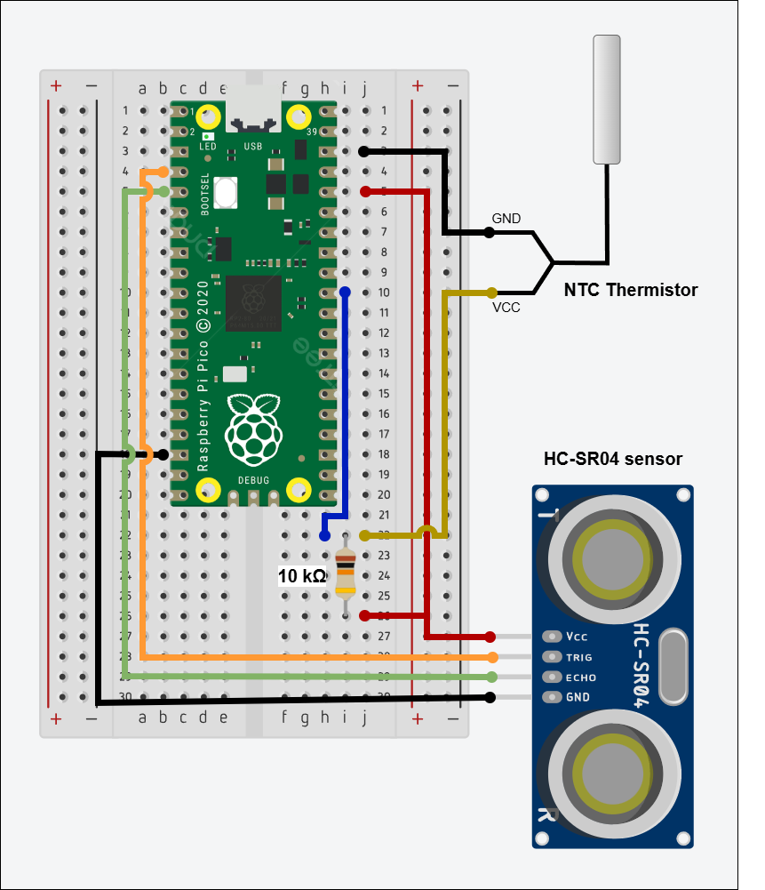

# Pico Measurement Station

This project presents a measurement station using Raspberry Pi Pico W. The station uses two measurement boards:

- **HC-SR04** for measuring distance
- **NTC Thermistor** for measuring temperature

## Configuration

Pico board has the main code in "*code.py*" file, therefore it is executed right after startup. It is possible to configure this program in two ways:

1. **Global settings** - In "*settings.toml*" file, it is possible to configure several aspects of the station, including Wi-Fi connection and TFTP server for storing measurements.

```python
WIFI_SSID = "<ssid>"
WIFI_PASSWORD = "<password>"

NTP_SERVER = "<ntp-server>"
TIMEZONE = 1

TFTP_SERVER = "<tftp-server-ip>"
TFTP_PORT = 69
```

2. **Measurement settings** - Directly in "*code.py*" file, it is possible to configure measurement features, e.g. how many cycles should be executed or how long should the program sleep between these cycles.

```python
def configuration() -> dict:
    num_of_cycles = 10
    num_of_measurements = 10
    
    sleep_between_cycles = 60
    sleep_between_temperature = 3
    sleep_between_distance = 1
    
    measurement_filename = "data.json"
    
    return {"num_of_cycles": num_of_cycles,
            "num_of_measurements": num_of_measurements,
            "sleep_between_cycles": sleep_between_cycles,
            "sleep_between_temperature": sleep_between_temperature,
            "sleep_between_distance": sleep_between_distance,
            "measurement_filename": measurement_filename}
```

## Connection diagram

Sensors are connected to the Raspberry Pi Pico in the following way:

| Pico  | HC-SR04  | NTC Thermistor  |
|---|---|---|
|  3V |  VCC |  VCC (via 10 kΩ resistor) |
| GND  |  GND | GND  |
| GPIO 2  | TRIG  | -  |
| GPIO 3  | ECHO  |  - |
| ADC 0 (GPIO 26)  | -  | VCC (directly)  |

As for a graphical representation, connections are following:



## Program output

Program has 3 modes of console output:

1. **Basic output** - Basic information about measurements and other activities are printed out. In "*code.py*", set this constant:

```python
PRINT_OUTPUT = True
```

2. **Verbose output** - Additional information about measurements (partial and final) and other activities are printed out with higher verbosity. In "*code.py*", set this constant:

```python
VERBOSE = True
```

3. **No output** - No information are printed out to console. This mode is recommended when there is no console available. In "*code.py*", set this constant:

```python
PRINT_OUTPUT = False
```

***Note**: Constant VERBOSE does not have any effect when PRINT_OUTPUT is set to "False".*